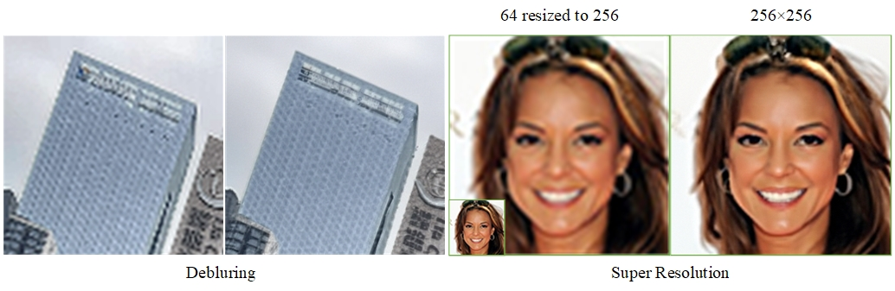
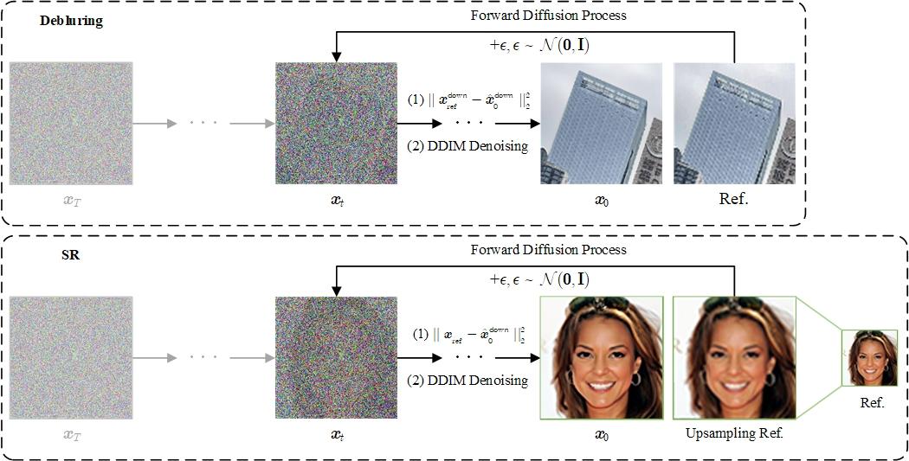

# IRDiff


For super-resolution and deblurring tasks, reverse denoising starts from the degraded image forward noised to a certain timestep (default is the 150th step, where a clear outline is present but texture details have not yet been restored). Combining the skip sampling strategy proposed in our GuidPaint, the sampling time can be significantly reduced.

## Requirements
### Environment
The code requires `python>=3.8`, as well as `pytorch>=1.7` and `torchvision>=0.8`.
Install conda environment by running
```
conda env create -f environment.yaml
conda activate irdiff
```

### Download pretrained models and datasets
```shell
bash scripts/download.sh
```

## Image Restoration with DDIM
### Patch Splitting
```text
Split the image into 256*256 patches (If you use 512*512 Diffusion Models, you can split the image into 512*512 patches).
```
```shell
python scripts/preprocess_crop.py
```
### Patch IR and Merging


```text
Input parameter description：
python main.py
    --config_file           Main config file path
    --input:                The path to the input image or folder
    --output:               Output directory
    --gpu                   Select GPU device to run (default: 0)
    --use_diffusion         Enable diffusion model for IR (disabled by default)
    --use_merge             Use the merge function to combine the restored patches
    
    --debug                 Save intermediate outputs (disabled by default)
    --mode                  Select task type # sr, deblur
    --n_samples             Set the batch size (the number of generation)
    --scale                 Set the zoom scale factor for deblur (No additional settings are needed for SR)
    --ddim.start_step       IR starting step (default: step 150)
```

```shell
python main.py --config_file configs/config.yaml --input data_sr/celeb_sample-64.jpg --output results  --use_diffusion --algorithm o_ddim --mode sr --debug --scale 2 --ddim.start_step 150 
```

## References
the real world noised images come from ZTE (https://challenge.zte.com.cn).

Our implementation is based on following repos:
*https://github.com/openai/guided-diffusion
